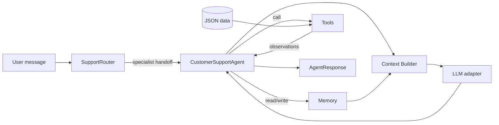

# Architecture — Intro AI Agents

Этот проект показывает agent architecture в форме, которую легко расширять: компоненты разделены протоколами, а агент связывает их в один воспроизводимый loop.

## Component responsibilities

### `interfaces.py`

Defines the contracts for replaceable parts:

- `LLM.complete(messages)` — any chat/completion backend;
- `Memory.remember/recall(user_id)` — any memory store;
- `Tool.__call__(**kwargs)` — any JSON-friendly tool implementation.

### `tools.py`

Contains support-domain actions:

- `get_invoice(invoice_id)`;
- `lookup_customer(email)`;
- `get_subscription(subscription_id)`;
- `search_faq(query)`;
- `create_refund_request(invoice_id, reason)`.

The tools read small JSON datasets from `support_agent/data/`. The shape mirrors MCP thinking: each tool has a name, description, structured input and structured output. Today they are Python functions; later the same boundary can move behind an MCP server.

### `memory.py`

Stores user-scoped facts. The current implementation is in-process, but the agent only depends on the `Memory` protocol, so it can be replaced by Redis, Postgres, a vector store, or a profile service.

### `context.py`

Builds the prompt payload:

1. base system instruction;
2. known memory facts;
3. tool observations;
4. current user message.

This is the context engineering layer: it decides what the LLM sees and what stays outside the context window.

### `agent.py`

Implements the loop:

1. parse user message;
2. decide which tools are needed;
3. collect observations;
4. build context;
5. ask the LLM adapter for a response draft;
6. render a support answer grounded in tool data.

### `multi_agent.py`

Shows a routing pattern: `SupportRouter` maps user intent to a specialist label (`risk-agent`, `refund-agent`, `billing-agent`, `tech-agent`) and then delegates the actual support response to the base customer support agent.

## Why the default LLM is deterministic

`EchoLLM` keeps the first run stable in local terminals and Colab. That makes tests and onboarding deterministic. A real provider adapter should implement the same `LLM` protocol, so the rest of the code does not need to change.
